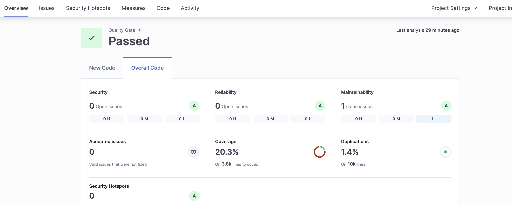
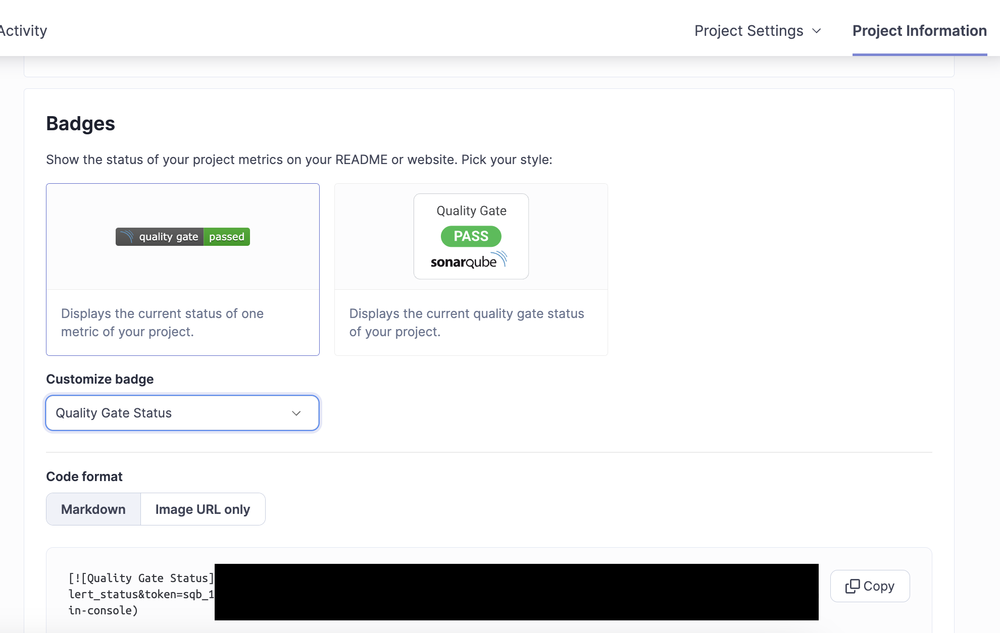
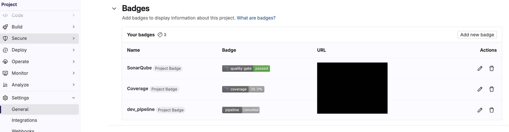
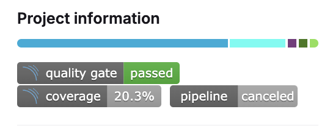

# Go_GitLab_SonarQube_Example
An example for go project on GitLab and integration with SonarQube

---

## GitLab 與 SonarQube 整合
請參閱[GitLab CI 可以自動檢測程式碼品質！SonarQube 程式碼品質檢測怎麼做？](https://medium.com/@martina.says/gitlab-ci-%E5%8F%AF%E4%BB%A5%E8%87%AA%E5%8B%95%E6%AA%A2%E6%B8%AC%E7%A8%8B%E5%BC%8F%E7%A2%BC%E5%93%81%E8%B3%AA-sonarqube-%E7%A8%8B%E5%BC%8F%E7%A2%BC%E5%93%81%E8%B3%AA%E6%AA%A2%E6%B8%AC%E6%80%8E%E9%BA%BC%E5%81%9A-7002bd0dcc5a)

## SonarQube Project Properties
因為我們其實都是使用 SonarScanner 在掃描然後才把結果上傳至 SonarQube server, 所以需要一隻檔案名為`sonar-project.properties` 來給scanner 解讀該專案的配置.

**專案基本設定**
```yaml=
sonar.projectKey=xxx        # 專案在SonarQuber中的唯一識別碼
sonar.projectName=yyyy   # 專案名稱
sonar.qualitygate.wait=true              # 等待品質閘道檢查完成

sonar.scm.provider=git                   # 使用 git 作為version control
```

**原始碼分析範圍設定**
```yaml=
sonar.sources=.                          # 分析的根目錄（當前目錄）
sonar.inclusions=**/*.go                 # 只分析 .go 檔案
# 排除以下檔案：
sonar.exclusions=**/*_test.go,\          
                **/vendor/**,\          
                **/mock_*.go,\          
                **/*.pb.go,\           
                **/contract/*.go,\       
                **/*.pb.ts,\      
                **/docs/**             
```
**測試相關設定**
```yaml=
sonar.tests=.                           # 測試檔案的根目錄
sonar.test.inclusions=**/*_test.go      # 包含所有 test.go 檔案
sonar.test.exclusions=**/vendor/**,     # 排除 vendor 目錄中的測試

sonar.go.coverage.reportPaths=coverage.out  # 程式碼覆蓋率報告的路徑
sonar.go.tests.reportPaths=test.out        # 測試結果報告的路徑
sonar.coverage.exclusions=               # 不計入覆蓋率統計的檔案：
    **/*_mock.go,\            
    **/mock/**/*,\                      
    cmd/**/*,\                      
    main.go,\                           
    **/test/**/*,\                      
    **/tests/**/*,\                     
    infrastructure/**/*,\             
    internal/config/**/*,\               
    internal/driver/**/*               
```

但其實 SonarQube Scanner 本身不會直接執行`go test`指令, 畢竟他裡面也沒安裝 Go SDK, 所以需要依賴預先產生的測試報告檔案.因此接著就看 CI pipeline 中怎將報告傳遞給 SonarQube Scanner.

## GitLab CI Pipeline

在 GitLab CI 中，我們需要設定適當的 pipeline 來執行測試並產生報告給 SonarQube Scanner 使用。以下是一個基本的 `.gitlab-ci.yml` 配置範例：

```yaml
stages:
  - test
  - sonarqube

unit-test:
  stage: test
  script:
    # 執行測試並產生測試報告
    - go test -json ./... > test.out
    # 產生覆蓋率報告
    - go test -coverprofile=coverage.out ./...
  artifacts:
    paths:
      - test.out
      - coverage.out
    expire_in: 1 day  # 設定報告檔案的保存期限

sonarqube-check:
  stage: sonarqube
  image: 
    name: sonarsource/sonar-scanner-cli
    entrypoint: [""]
  dependencies:
    - unit-test  # 確保能取得測試階段產生的報告
  script:
    - sonar-scanner
  only:
    - merge_requests
    - main
    - develop
```

這個 pipeline 主要分為兩個階段：

1. test 階段：

- 使用 golang 映像檔執行測試
- 產生兩個重要的報告檔案：
    - test.out：測試結果報告
    - coverage.out：程式碼覆蓋率報告
- 使用 artifacts 保存這些報告檔案

2. sonarqube 階段：
- 使用 SonarQube Scanner 官方映像檔
- 讀取先前產生的測試報告
- 執行程式碼品質分析
- 只在特定分支（main、develop）和合併請求時執行

注意事項：
- Pipeline 需要搭配前面提到的 sonar-project.properties 設定檔使用
- 確保 GitLab CI 環境變數中已設定必要的 SonarQube 相關變數（如 SONAR_TOKEN）
- 測試報告會暫時保存一天，供 SonarQube 分析使用
- 使用快取來優化 SonarQube Scanner 的執行效能

這樣的設定可以確保每次程式碼更新時，都能自動執行測試並進行程式碼品質分析，幫助團隊維持程式碼品質。


## 將結果以 GitLab Badge 呈現
當我們專案成功在 Scanner 掃描成功後, 就能在 SonarQube 網站上看到結果了.


且 SonarQube 還有個貼心的小功能, 就是能將結果以 Badge 的形式呈現. 點每個專案的`Project Information` 就能看到 Badges 了, 裡面有各種指標的 Bage 能選.


選擇好按下 Copy 後就能來到 GitLab 專案中, 一樣找到 Setting 頁面也有 Badge 能設定.


設定完成如下, 這樣我們的 GitLab Project 就能即時呈現 SonarQube 的 badge 了. 


當然要是掃描失敗, 是該發訊息到 Slack 通知該團隊做優化或修復的動作.