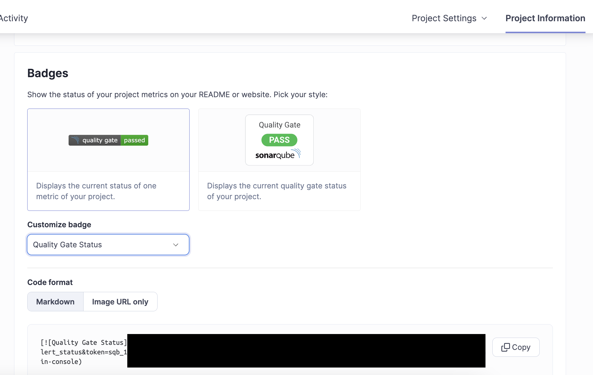
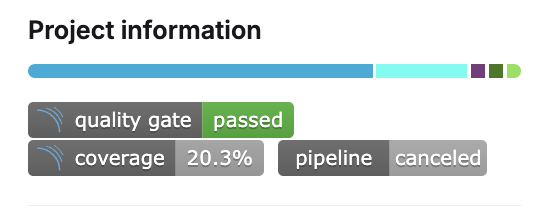

# Go_GitLab_SonarQube_Example
An example for Go project integration with GitLab and SonarQube

---
[中文版本](./README.md)

## GitLab and SonarQube Integration
For a detailed guide, you can refer to this [article about automating code quality checks with GitLab CI and SonarQube](https://medium.com/@martina.says/gitlab-ci-%E5%8F%AF%E4%BB%A5%E8%87%AA%E5%8B%95%E6%AA%A2%E6%B8%AC%E7%A8%8B%E5%BC%8F%E7%A2%BC%E5%93%81%E8%B3%AA-sonarqube-%E7%A8%8B%E5%BC%8F%E7%A2%BC%E5%93%81%E8%B3%AA%E6%AA%A2%E6%B8%AC%E6%80%8E%E9%BA%BC%E5%81%9A-7002bd0dcc5a).

## SonarQube Project Properties
SonarScanner is used to scan the codebase and upload results to the SonarQube server. The scanner requires a `sonar-project.properties` file to understand the project configuration.

**Basic Project Settings**
```yaml=
sonar.projectKey=xxx        # Unique identifier for the project in SonarQube
sonar.projectName=yyyy      # Project name
sonar.qualitygate.wait=true # Wait for quality gate check to complete
sonar.scm.provider=git      # Specify git as version control system
```

**Test-Related Settings**
```yaml=
sonar.tests=.                           # Root directory for tests
sonar.test.inclusions=**/*_test.go      # Include all test.go files
sonar.test.exclusions=**/vendor/**,     # Exclude tests in vendor directory

sonar.go.coverage.reportPaths=coverage.out  # Path to coverage report
sonar.go.tests.reportPaths=test.out        # Path to test results
sonar.coverage.exclusions=               # Files to exclude from coverage:
    **/*_mock.go,\            
    **/mock/**/*,\                      
    cmd/**/*,\                      
    main.go,\                           
    **/test/**/*,\                      
    **/tests/**/*,\                     
    infrastructure/**/*,\             
    internal/config/**/*,\               
    internal/driver/**/*               
```

Note that SonarQube Scanner doesn't execute `go test` commands directly as it doesn't include the Go SDK. Instead, it relies on pre-generated test reports. Let's see how to pass these reports through the CI pipeline.

## GitLab CI Pipeline
Here's a basic `.gitlab-ci.yml` configuration that sets up the pipeline for testing and SonarQube analysis:

```yaml=
stages:
  - test
  - sonarqube

unit-test:
  stage: test
  script:
    # Generate test reports
    - go test -json ./... > test.out
    # Generate coverage report
    - go test -coverprofile=coverage.out ./...
  artifacts:
    paths:
      - test.out
      - coverage.out
    expire_in: 1 day  # Set expiration for report files

sonarqube-check:
  stage: sonarqube
  image: 
    name: sonarsource/sonar-scanner-cli
    entrypoint: [""]
  dependencies:
    - unit-test  # Ensure access to test stage artifacts
  script:
    - sonar-scanner
  only:
    - merge_requests
    - main
    - develop
```

The pipeline consists of two main stages:
1. Test Stage:
    - Uses golang image to run tests
    - Generates two important report files:
        - test.out: Test execution results
        - coverage.out: Code coverage data
    - Preserves reports as artifacts
2. SonarQube Stage:
    - Uses official SonarQube Scanner image
    - Reads previously generated test reports
    - Performs code quality analysis
    - Runs only on specific branches and merge requests

Important Notes:

- Pipeline requires the sonar-project.properties file
- Ensure required SonarQube environment variables (e.g., SONAR_TOKEN) are set in GitLab CI
- Test reports are preserved for one day for SonarQube analysis
- Cache is used to optimize SonarQube Scanner performance

## Displaying Results with GitLab Badges
After successful scanning, results are available on the SonarQube dashboard. 


SonarQube provides a convenient feature to display results as badges. You can find these under the Project Information section, where various metric badges are available. 


After copying the badge URL, go to your GitLab project settings where you can configure badges. 


Once configured, your GitLab project will display real-time SonarQube badges. 


For failed scans, it's recommended to set up Slack notifications to alert the team for necessary optimizations or fixes.